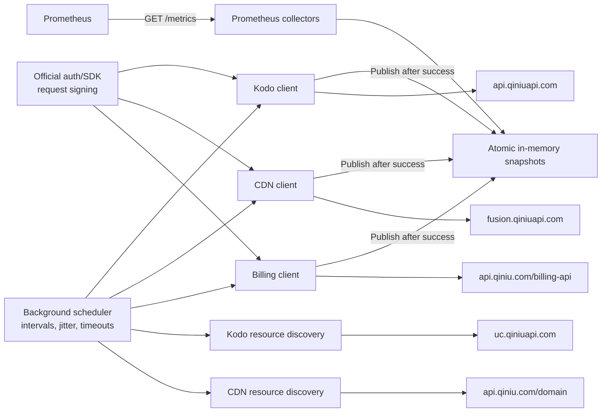

# qiniu_exporter Architecture and Metric Design

> Status: MVP implemented and reviewed for monitoring-only scope and rate limiting. Verification with a real account remains required before enabling Kodo/CDN verification gates or Billing in production.
>
> Research date: 2026-08-03
>
> Scope: Qiniu Kodo object storage, CDN, and account billing; read-only collection with no resource changes or financial operations.

## 1. Conclusion

The exporter is implemented in Go with background polling and in-memory snapshots:

- The supported deployment model is one Qiniu account per exporter instance. Configuration can name multiple credential sources, but every enabled module in one instance must use credentials belonging to the same account; credential ownership cannot be verified locally. Deploy multiple instances for multiple accounts and inject the account name as a Prometheus target label.
- Use the official `github.com/qiniu/go-sdk/v7/auth` package for signing. Build fixed, read-only requests for the Kodo, CDN, and billing statistics APIs with `net/http` and the official `auth` package.
- Kodo, CDN, and billing use independent pollers, limiters, credential references, and cached snapshots. Each module can be enabled or disabled independently.
- `/metrics` does not access the Qiniu APIs; it only reads immutable snapshots. When an upstream request fails, retain the last successful values within the staleness period allowed for that dataset while exposing collection failure and freshness. Stop exporting the business snapshot after that period expires.
- Export capacity, cost, historical time-bucket request counts, and historical time-bucket traffic returned by Qiniu as Gauges. Only exporter-owned cumulative event metrics use Counters.
- The MVP does not collect high-cardinality or sensitive dimensions such as object keys, URLs, IP addresses, order numbers, or bill IDs.
- The public CDN and Kodo statistics APIs do not provide real-time request latency, and Kodo also does not provide status codes or error rates. Use Blackbox Exporter, application metrics, or a phase-two log pipeline to fill these SLI gaps.

### 1.1 Monitoring-only Boundary

The main process exports only operational inventory, usage, and billing metrics. It uses fixed read-only inventory calls to discover accessible Kodo buckets and regions and CDN domains, because these dimensions are needed both for operations visibility and statistics queries. Enabled Kodo storage classes remain static configuration, and CDN regions returned by statistics APIs are accepted only from fixed, validated enums. Complete discovery snapshots publish bounded bucket/domain counts and `*_info` series. These describe current resources; they are not counters or latency metrics for management API operations.

The code does not implement any resource-management method for creating, deleting, updating, bringing online or offline, refreshing, prefetching, or canceling orders. Apart from the minimum read-only inventory needed for automatic discovery, it does not retrieve management details. It does not export request counts, results, latency, or errors for those management operations. The CDN inventory preserves the API's bounded `operatingState` field as resource state and clearly distinguishes it from an availability probe. Discovery, statistics, and billing clients use explicit endpoint allowlists and must not become general-purpose clients capable of calling arbitrary Qiniu APIs.

Recommended technical baseline: Go 1.23+ (the minimum version supported by the current Prometheus Go client), with the Qiniu Go SDK pinned to a version verified during implementation. The latest version at the time of research was [`v7.27.0`](https://pkg.go.dev/github.com/qiniu/go-sdk/v7); do not use an unconstrained floating dependency.

## 2. Assumptions and Non-goals

### 2.1 Current Assumptions

- One account per process is a deployment requirement. The configuration parser supports named credentials but cannot verify that different AK/SK pairs belong to the same account.
- The default Prometheus scrape interval is 30 seconds. It reads cached snapshots and is independent of Qiniu upstream collection intervals.
- Kodo bucket/region and CDN-domain discovery is scheduled immediately after startup and refreshed every hour by default. An initial failure leaves an empty inventory without blocking HTTP readiness; a later failed refresh retains the previous complete inventory. A successful refresh atomically adds and removes resources. Inventory and statistics catalogs use the same last-good resource set; discovery health and last-success age expose staleness.
- The billing timezone is fixed to `Asia/Shanghai`. The timezones of Kodo and CDN time fields must be confirmed with a real account during the PoC. Until confirmed, the `statistics_timezone_verified=false` runtime gate for each module prevents statistics calls and publication; read-only resource discovery still runs.
- The exporter only needs current state, the latest complete time bucket, the current-month estimate, the most recently finalized month, and a bounded current-year view of finalized monthly totals. It is not a historical ledger or reporting system.

### 2.2 Not Included in the Initial Release

- Do not call write APIs that create, modify, delete, refresh, prefetch, or cancel orders.
- Do not put Top URLs, Top IPs, object keys, client IPs, User-Agent values, or Referer values into Prometheus.
- Do not persist 24 months of billing details or use `month=YYYY-MM` as a continuously growing label.
- Do not perform synthetic Kodo PUT/DELETE probes with write side effects inside the exporter.
- Do not download or parse access logs in the main exporter. If needed later, build this as a separate log pipeline.
- Do not expose order, cost-allocation, historical-ledger, or arbitrary resource-management APIs, even when they are read-only. The only control-plane exception is the fixed minimum inventory required for Kodo/CDN discovery; only bounded resource counts and identity/state info metrics are derived from it.

## 3. Overall Architecture



Core behavior:

1. Each dataset has independent scheduling, timeout, and snapshot publication.
2. Validate a response completely before replacing a snapshot. Global data uses the dataset as its atomic boundary. Data fanned out by bucket or domain uses `dataset + resource` as its atomic boundary, allowing healthy resources to keep updating while recording freshness separately for each resource.
3. On request failure, do not write business values as 0 or immediately clear old snapshots. Set `collector_success=0`. Stop exporting stale business samples after the dataset's `stale_after` period; keep self-monitoring metrics.
4. Before the first successful collection, expose only exporter self-monitoring metrics; business samples are absent.
5. `/healthz` indicates that the process is alive. `/readyz` checks only that configuration, the HTTP service, and the scheduler are ready; it does not depend on the first successful upstream request. Collection-success and freshness metrics fully represent upstream status.

Prometheus generally recommends synchronous collection during a scrape, but permits caching expensive data. Qiniu APIs update infrequently, fan out across resources, and have explicit rate limits, so background caching is an intentional exception here. Data freshness must be treated as a first-class metric. See the [Prometheus exporter guidelines](https://prometheus.io/docs/instrumenting/writing_exporters/).

## 4. API, SDK, and Authentication Matrix

| Module | Host / API | Authentication | SDK strategy | Known limitations |
|---|---|---|---|---|
| Kodo discovery | `GET https://uc.qiniuapi.com/buckets?apiVersion=v4` | Qiniu v2; `X-Qiniu-Date` | Fixed, bounded, paginated read-only inventory client using the official SDK's v4 request shape | Account-wide listing may require broader read permission than bucket-scoped statistics |
| Kodo statistics | `https://api.qiniuapi.com/v6/*` | Qiniu v2; `X-Qiniu-Date` | Custom read-only client + `auth.AddToken(TokenQiniu, req)` | Approximately 5 minutes of latency; public documentation does not specify QPS, maximum data points, or a consistent timezone |
| CDN discovery | `https://api.qiniu.com/domain` | Qiniu v2; `X-Qiniu-Date` | Fixed, bounded, paginated read-only inventory client + official auth | All CDN product domains are inventoried; only `operatingState=success` domains are admitted to statistics calls; explicit `product=dcdn` entries are excluded; shares the account-level `api.qiniu.com` quota |
| CDN monitoring/analytics | `https://fusion.qiniuapi.com/v2/tune/*` | QBox | Fixed read-only REST client for core monitoring/analytics + official auth | 5-10 QPS; shares the quota with other callers using the same account |
| Billing | Only four fixed GET endpoints: `balance-overview`, `bill/snapshot`, `respack/month-overview`, and `bill/detail` | Qiniu v2 | Custom fixed-GET client + official auth | QPS is unpublished; public documentation does not specify billing IAM actions |

### 4.1 Signing Constraints

- Always use [`auth.Credentials`](https://pkg.go.dev/github.com/qiniu/go-sdk/v7/auth): call `auth.New(ak, sk)`, then call `AddToken(TokenQiniu, req)` or `AddToken(TokenQBox, req)`, as appropriate. Do not reimplement the HMAC algorithm.
- Qiniu v2 signing covers the method, path/query, Host, Content-Type, relevant `X-Qiniu-*` headers, and any signable body. Construct the request completely before signing it.
- QBox uses different signing rules; do not use Qiniu v2 for `fusion.qiniuapi.com` CDN requests.
- Rebuild the replayable body for every retry. Acquire the limiter token first, then refresh the date header and sign again so queueing does not leave a stale signature. Never reuse the old Authorization header.
- The production transport permits only `https`, an exact Host, and fixed method/path combinations. Reject an explicit `Host` override before signing.
- Qiniu v2 date headers allow only limited clock skew, and billing day boundaries and statistics windows also depend on accurate time. The host must maintain NTP synchronization.
- Billing documentation examples do not require `X-Qiniu-Date`. Do not treat it as mandatory for the billing API until integration testing confirms it.

### 4.2 SDK Boundary

The Qiniu Go SDK provides:

- `auth`: Qiniu/QBox request signing.

The SDK does not fully cover Kodo `/v6/*` statistics, the newer CDN monitoring/analytics APIs, or the billing APIs. Use small typed REST clients for those areas, with DTOs that model only the fields actually used.

## 5. Kodo Object Storage

Official entry point: [Kodo Data Statistics APIs](https://developer.qiniu.com/kodo/3906/statistic-interface).

### 5.1 Required APIs

| Priority | Dataset | API | Purpose and conversion |
|---|---|---|---|
| P0 | Resource discovery | `GET https://uc.qiniuapi.com/buckets?apiVersion=v4&limit=100&marker=...` | List accessible buckets with their regions in one paginated read-only response; publish only the bounded inventory count and identity/region info |
| P0 | Capacity | `/v6/space`, `/v6/space_line`, `/v6/space_intelligent_tiering`, `/v6/space_archive_ir`, `/v6/space_archive`, `/v6/space_deep_archive` | Point-in-time capacity for each storage class, in bytes; use fixed `g=5min` for the current day and select the latest complete point |
| P0 | Object count | The six corresponding `/v6/count*` endpoints | Object count; these are not a single `/v6/count?storage_type=...` endpoint |
| P0 | GET/egress | `/v6/blob_io` | `hits`; `flow_out`/`cdn_flow_out` in bytes; fixed `g=5min` |
| P0 | Customer workload PUT count | `/v6/rs_put?select=hits` | Read-only query for PUT requests generated by the customer's workload; the exporter does not perform object PUTs; fixed `g=5min` |

For the current capacity/object APIs, `begin` is inclusive and `end` is exclusive, both formatted as `YYYYMMDDHHmmss`. Historical data usually supports only day granularity; the current day supports 5min/hour/day. `blob_io` and `rs_put` support 5min/hour/day/month. The current implementation uses only the P0 endpoints above. Legacy statistics, cross-region tasks, and early-deletion analysis are outside the MVP.

The storage-class mapping is fixed:

| `storage_class` | Qiniu meaning | `$ftype` (optional for I/O) |
|---|---|---|
| `standard` | Standard storage | `0` |
| `ia` | Infrequent Access storage | `1` |
| `archive` | Archive storage | `2` |
| `deep_archive` | Deep Archive storage | `3` |
| `archive_ir` | Archive Instant Retrieval | `4` |
| `intelligent_tiering` | Intelligent-Tiering storage | `5` |

P0 request and traffic statistics are aggregated by bucket without a `storage_class` label, avoiding a sixfold increase in calls for the six `$ftype` values. The MVP does not provide an I/O collector broken down by storage class.

Discovery is all-or-nothing. Sort and deduplicate bucket names, validate each
returned region, enforce a bounded inventory size, and replace the active
inventory only after every page passes call-budget admission. If any page,
validation, or admission check fails, retain the previous complete inventory
and its snapshots. The v4 listing returns regions directly and avoids an N+1
per-bucket region lookup.

### 5.2 P0 Metrics

| Metric | Type | Labels | Semantics |
|---|---|---|---|
| `qiniu_kodo_buckets` | Gauge | none | Number of buckets in the latest complete discovery snapshot; zero is distinct from unavailable |
| `qiniu_kodo_bucket_info` | Gauge | `bucket,region` | Constant 1 for each bucket in the latest complete read-only inventory |
| `qiniu_kodo_storage_bytes` | Gauge | `bucket,region,storage_class` | Storage capacity at the latest complete point |
| `qiniu_kodo_objects` | Gauge | `bucket,region,storage_class` | Object count at the latest complete point |
| `qiniu_kodo_requests_per_second` | Gauge | `bucket,region,operation` | Average request rate for the latest complete bucket; `operation` is `get`/`put` |
| `qiniu_kodo_egress_bytes_per_second` | Gauge | `bucket,region,route` | Average egress rate for the latest complete bucket; `route` is `direct`/`cdn_origin` |

`blob_io` and `rs_put` return increments over historical intervals, not monotonically increasing values over the exporter process lifetime. Therefore, their metrics must not use a `_total` suffix or masquerade as Counters. P0 always requests `g=5min` and divides by 300. It also validates point alignment and verifies that adjacent points are exactly 5 minutes apart. Do not export a rate when a bucket is missing or only one point is available and its window cannot be confirmed. If other granularities are supported later, convert using the defined duration of the requested granularity; do not infer coverage from the distance between points across missing buckets.

### 5.3 Kodo Operational Gaps

The public statistics APIs do not provide HTTP status codes, error rates, request latency, P95, or P99. The optional [bucket access logs](https://developer.qiniu.com/kodo/8614/space-access-log) are written to a log bucket approximately every 10 minutes and contain fields such as HTTP Status, RequestTime, and SentBytes. A separate phase-two log processor can generate SLIs from these logs. Application metrics or active probes should provide real-time availability first.

## 6. CDN

Qiniu's CDN APIs use two hosts and two authentication schemes. The exporter calls the read-only, paginated `GET /domain` inventory endpoint through `api.qiniu.com` with Qiniu v2 authentication, then calls only statistics endpoints through `fusion.qiniuapi.com` with QBox authentication. It does not call any domain mutation endpoint or export telemetry about management API operations. See the official [CDN API overview](https://developer.qiniu.com/fusion/13353/fusion-api-overview).

### 6.1 Required APIs

| Priority | Dataset | API | Key constraints |
|---|---|---|---|
| P0 | Resource discovery | `GET https://api.qiniu.com/domain` | Paginated read-only inventory; export CDN product domains and use only `operatingState=success` domains for statistics |
| P0 | Real-time monitoring bandwidth | `POST /v2/tune/monitoring/bandwidth` | `domains` is a semicolon-delimited string, maximum 50; 5min/hour/day |
| P0 | Real-time monitoring traffic | `POST /v2/tune/monitoring/flow` | Same as above; monitoring data is retained for 90 days |
| P0 | Request volume | `POST /v2/tune/loganalyze/reqcount` | `domains` is an array; 5min/1hour/1day |
| P0 | Status codes | `POST /v2/tune/loganalyze/statuscode` | Returns `codes[statusCode]` time series; preserve response keys and confirm their granularity during the PoC |
| P0 | Cache hits | `POST /v2/tune/loganalyze/hitmiss` | Returns hit/miss counts and hit/miss traffic; the exporter calculates ratios |

CDN usage APIs accept at most 50 domains per request and preserve the domain dimension in responses, so they can be batched. Although analytics APIs accept up to 100 domains, their response structures do not include a domain dimension. To emit per-domain metrics, the MVP queries only one domain at a time. This aggregation behavior is a mandatory PoC check.

Domains come exclusively from a complete successful discovery result and are sorted and deduplicated before admission. Discovery follows pagination with fixed page and resource limits. All CDN product domains are published in the inventory snapshot, while only domains with `operatingState=success` enter statistics catalogs. A failed refresh retains the previous inventory. When batch monitoring encounters `400032`, use binary splitting to find invalid domains and negative-cache them until the next successful discovery refresh, while marking each as a collection error so one invalid domain cannot freeze the entire batch. Each round permits at most 16 batch attempts for binary splitting; each attempt may call bandwidth and flow at most once. Domains left unresolved when the budget is exhausted fail for that round but are not added to the negative cache, so the next round evaluates them again.

### 6.2 P0 Metrics

| Metric | Type | Labels | Semantics |
|---|---|---|---|
| `qiniu_cdn_domains` | Gauge | none | Number of CDN domains in the latest complete discovery snapshot; zero is distinct from unavailable |
| `qiniu_cdn_domain_info` | Gauge | `domain,operating_state,product` | Constant 1 for each domain in the latest complete read-only inventory; `operating_state` is the latest management-operation state, not an availability probe |
| `qiniu_cdn_monitoring_bandwidth_bits_per_second` | Gauge | `domain,region` | Bandwidth in the latest complete monitoring bucket |
| `qiniu_cdn_monitoring_traffic_bytes_per_second` | Gauge | `domain,region` | Traffic in the latest complete monitoring bucket divided by bucket duration in seconds |
| `qiniu_cdn_requests_per_second` | Gauge | `domain,region` | Average RPS in the latest complete `reqcount` bucket |
| `qiniu_cdn_http_responses_per_second` | Gauge | `domain,region,code` | Average response rate by status code; preserve the validated `code` value returned by the API without assuming that it is necessarily a category or an exact code |
| `qiniu_cdn_cache_requests_per_second` | Gauge | `domain,result` | Hit/miss request count divided by bucket duration in seconds; `result` is `hit`/`miss` |
| `qiniu_cdn_cache_traffic_bytes_per_second` | Gauge | `domain,result` | Hit/miss traffic divided by bucket duration in seconds |
| `qiniu_cdn_cache_request_hit_ratio` | Gauge | `domain` | `hit / (hit + miss)`, range 0-1 |
| `qiniu_cdn_cache_traffic_hit_ratio` | Gauge | `domain` | `trafficHit / (trafficHit + trafficMiss)`, range 0-1 |

The monitoring bandwidth/flow documentation does not restate the response units. Although they are expected to remain bps/bytes, verify them against the console and real responses before enabling the unit-bearing metrics above. The `cdn.monitoring_units_verified` setting defaults to `false`. When units are unverified, do not call these two endpoints; record a scheduling skip with `reason="units_unverified"`, do not create a permanent failure state, and do not publish unit-dependent business samples. Set the option to `true` only after confirming that bandwidth is in bit/s and traffic is the number of bytes in a five-minute bucket. All CDN collection is also subject to the `statistics_timezone_verified` gate.

### 6.3 CDN Operational Gaps

The public analytics APIs do not provide real-time response latency. CDN access logs contain `ResponseTime` in milliseconds, but arrive with approximately six hours of delay and are unsuitable for real-time incident alerts. Recommendations:

- Real-time domain availability and DNS/TLS/HTTP latency: Blackbox Exporter.
- Historical Qiniu-side P50/P95/P99: asynchronously parse completed hourly CDN logs in phase two.
- Top URLs/IPs: send only to logging/reporting systems, not Prometheus.

## 7. Billing

Official entry point: [Billing External API Documentation](https://developer.qiniu.com/af/10420/financial-external-api-documentation). Billing data consists of low-frequency accounting snapshots and must not be requested at the Prometheus scrape interval.

### 7.1 Required APIs

| Priority | Dataset | API | Purpose and time semantics |
|---|---|---|---|
| P0 | Balance | `GET /billing-api/v1/account/balance-overview` | Available balance, unpaid amount, cash/gift balance/credit limit; estimate fields are used only for cross-checking |
| P0 | Daily estimate | `GET /billing-api/v2/bill/snapshot?date=...` | Query after 08:00; covers 00:00 on the first day of the current month through 00:00 on the query date, excluding the query date |
| P0 | Resource packs | `GET /billing-api/v1/respack/month-overview` | Total available, used, and remaining this month; maximum page size 200 |
| P0 | Final monthly bill | `GET /billing-api/v2/bill/detail?start=...&end=...` | Use top-level `total_money`; read the previous month on or after the fifth day of each month |

Money fields are fixed-point integers with eight decimal places and must be divided by `100000000` before export. The currency can be CNY or USD, so metric names do not hard-code `_yuan`. A controlled `currency` label represents the currency, and HELP text makes clear that values are expressed in that currency's major unit.

`bill/overview` returns bill/order entries and does not provide a reliable top-level monthly total. The most recently finalized total must use `bill/detail`'s `total_money`. The balance API field table uses `available_balance`, while its response example uses `balance`. The DTO must accept either field and report an error if both are present with different values.

### 7.2 P0 Metrics

| Metric | Type | Labels | Semantics |
|---|---|---|---|
| `qiniu_billing_available_balance` | Gauge | `currency` | Current available balance in the currency's major unit |
| `qiniu_billing_unpaid_amount` | Gauge | `currency` | Current unpaid amount |
| `qiniu_billing_estimated_cost` | Gauge | `currency` | Cumulative estimated cost for the period represented by `bill/snapshot.total_money`; do not assert that it is MTD |
| `qiniu_billing_estimate_period_start_timestamp_seconds` | Gauge | None | Start of the period covered by the daily estimate |
| `qiniu_billing_estimate_period_end_timestamp_seconds` | Gauge | None | End of the period covered by the daily estimate (exclusive) |
| `qiniu_billing_resource_pack_records` | Gauge | None | Number of resource-pack monthly-overview records in the complete paginated result; 0 may be used for absence alerts |
| `qiniu_billing_resource_pack_total` | Gauge | `item,zone,available_time,unit` | Total available this month; aggregation across units is forbidden |
| `qiniu_billing_resource_pack_used` | Gauge | `item,zone,available_time,unit` | Amount used this month |
| `qiniu_billing_resource_pack_remaining` | Gauge | `item,zone,available_time,unit` | Amount remaining this month |
| `qiniu_billing_resource_pack_remaining_ratio` | Gauge | `item,zone,available_time,unit` | `month_remain / total_surplus`, range 0-1; absent when there are no records |
| `qiniu_billing_last_finalized_cost` | Gauge | `currency` | Total cost for the most recently fully finalized month |
| `qiniu_billing_last_finalized_period_start_timestamp_seconds` | Gauge | None | Start of the most recently finalized month |
| `qiniu_billing_current_year_monthly_finalized_cost` | Gauge | `currency,month` | Finalized monthly total in the current Asia/Shanghai calendar year; `month` is one of the fixed values `01`–`12` |

A snapshot queried on the first day of a month represents the entire previous month, not current-month MTD. The estimate metric therefore uses a neutral name and exposes period start/end separately. Do not use `bill_id`, `order_hash`, `po_id`, email, `YYYY-MM` values, or any cost-allocation label as a label. The current-year metric uses only the fixed two-digit month-of-year label and is atomically replaced at the year boundary.

The finalized-bill job uses the same single-month `bill/detail` endpoint for
the latest-month compatibility metrics and the current-year view. The first
run backfills only finalized months in the current year (at most 11 distinct
monthly client operations), caching every successful immutable month in
memory. Each operation may make up to three bounded HTTP attempts for retryable
failures, subject to the job deadline and the same layered limiters. Daily runs make no request
until a new month becomes eligible after the fifth day, then normally make one
request. A partial backfill never replaces the last complete annual snapshot;
the next run requests only missing months. A process restart intentionally
rebuilds the bounded cache rather than adding persistent state.

Raw resource-pack usage mixes units such as GB, thousands of requests, and minutes. Preserve a controlled `unit` label and forbid summing across units in rules and dashboards. `item/zone/available_time/unit` must exactly match a static tuple allowlist in the configuration. When the allowlist is empty, do not call the resource-pack API or export the corresponding metrics. Resource-pack pagination is all-or-nothing: if any page fails or contains an unconfigured label, do not publish partial results. If a complete successful result is empty, atomically clear the old resource-pack snapshot and export `records=0`. The MVP reads at most 50 pages of 200 records each. If pagination has not ended at that limit, fail the entire round to prevent anomalous pagination from causing unbounded calls. Accept only the officially documented currencies, `CNY` and `USD`.

## 8. Exporter Self-monitoring Metrics

| Metric | Type | Labels | Semantics |
|---|---|---|---|
| `qiniu_exporter_build_info` | Gauge | `version,revision,goversion` | Build information with a constant value of 1 |
| `qiniu_exporter_collector_success` | Gauge | `module,collector` | 1 when the latest poll of a single task succeeded, or when the latest poll for every current discovered resource succeeded |
| `qiniu_exporter_collector_last_success_timestamp_seconds` | Gauge | `module,collector` | Latest successful time for a single task; for resource-oriented tasks, the oldest latest-success time across resources |
| `qiniu_exporter_collector_stale_after_seconds` | Gauge | `module,collector` | Maximum freshness duration configured for this enabled collector; used as an alert threshold |
| `qiniu_exporter_data_timestamp_seconds` | Gauge | `module,collector` | Effective upstream data time represented by the current snapshot; absent when upstream does not provide a data time |
| `qiniu_exporter_collection_duration_seconds` | Gauge | `module,collector` | Duration of the latest poll |
| `qiniu_exporter_api_requests_total` | Counter | `service,endpoint,result` | Number of upstream calls over the exporter lifetime; `endpoint` and `result` are controlled enums |
| `qiniu_exporter_api_request_duration_seconds` | Histogram | `service,endpoint` | Upstream API call latency |
| `qiniu_exporter_api_rate_limit_events_total` | Counter | `service,host` | Number of 429/403024 events |
| `qiniu_exporter_api_limiter_wait_duration_seconds` | Histogram | `service,host` | Time spent waiting for a local limiter token |
| `qiniu_exporter_scheduler_skipped_total` | Counter | `module,collector,reason` | Scheduling-skip events. A disabled verification gate records one startup event because no recurring task is registered; an `overlap` event is recorded when a completed run consumes or exceeds its interval. |
| `qiniu_exporter_resource_collector_success` | Gauge | `module,collector,resource` | Whether the latest per-bucket/domain poll succeeded |
| `qiniu_exporter_resource_last_success_timestamp_seconds` | Gauge | `module,collector,resource` | Latest per-resource success time |
| `qiniu_exporter_resource_data_timestamp_seconds` | Gauge | `module,collector,resource` | Effective upstream data time per resource; absent when unknown |

`result` permits only a bounded set such as `success`, `api_error`, `rate_limited`, `http_4xx`, `http_5xx`, `transport_error`, and `decode_error`; never use raw error text. Validate the HTTP status first, then the JSON envelope. For example, a billing response with HTTP 200 but `code != 0` must be classified as `api_error` and fail that round. When the upstream data time is known, use `time() - qiniu_exporter_data_timestamp_seconds > qiniu_exporter_collector_stale_after_seconds` to detect stale business data. When it is unknown, apply the same configured threshold to `collector_last_success_timestamp_seconds`; no duplicate age metric is needed.

Dataset-level `collector_success` is 1 only when the latest poll succeeded for every resource in the current discovered inventory. For a resource-oriented collector, `collector_last_success_timestamp_seconds` is the oldest latest-success time among those resources; it must not advance merely because one healthy resource continues to succeed. Resource metrics identify individual failures. Dataset-level `data_timestamp` is the oldest known upstream time among the current resource snapshots; per-resource alerts use the resource data timestamp. Only enabled collectors export `collector_stale_after_seconds`, preventing generic freshness rules from alerting on disabled features.

## 9. Label and Cardinality Rules

Permitted business labels:

- Kodo: `bucket`, `region`, `storage_class`, and bounded operation/route enums.
- CDN: `domain`, `region`, bounded `operating_state`/`product` inventory enums, and format-validated status-code keys returned by the API.
- Billing: `currency` and allowlisted `item`, `zone`, `available_time`, and `unit` values.

The resource-pack allowlist contains at most 200 tuples, producing at most about 800 detailed business time series. If more are needed, split the exporter or monitoring scope and evaluate Prometheus cardinality first instead of relaxing the bounded limit. A CDN status-code response must not contain both an aggregate key and an exact key from the same class, such as `5xx` and `500`, because rules could double-count them.

Forbidden labels: AK/SK, UID/email, `account_id`, object key, complete URL, client IP, User-Agent, Referer, CNAME, task ID, order/bill/PO ID, timestamp string, or any uncontrolled bucket tag.

The initial release does not add an `account` label to every metric. Under the one-account-per-process deployment requirement, Prometheus scrape configuration should inject that account's alias as a target label, for example `qiniu_account="production"`. This follows the Prometheus convention that dimensions common to all metrics belong in target labels and avoids duplicated state inside the exporter.

## 10. Scheduling, Rate Limits, and Call Budgets

### 10.1 Layered Rate Limiting

All requests pass through layered limiters. The first layer limits the account's aggregate rate to the actual hostname, and the second layer further restricts endpoint classes with unknown quotas. A separate normal-collection budget applies only to attempt 0. A primary account and its subaccounts share the CDN quota, so they must not receive independent token buckets per credential.

| Quota group | Hard limit | First-attempt budget | Retry budget | Burst | Maximum concurrency | Basis |
|---|---:|---:|---:|---:|---:|---|
| `qiniu-api-shared` (`api.qiniu.com`) | 10 QPS | 8 QPS | 2 QPS | 1 | 4 | Official per-account limit for this Host; shared by CDN discovery and Billing |
| `cdn-fusion` (`fusion.qiniuapi.com`) | 5 QPS | 4 QPS | 1 QPS | 1 | 4 | Official range is 5-10 QPS; use its lower bound |
| `kodo-shared` (`api.qiniuapi.com`, `uc.qiniuapi.com`) | 1 QPS | 0.8 QPS | 0.2 QPS | 1 | 1 | Process-wide local safety budget shared by Kodo statistics and discovery; official limits are unpublished |
| `billing` (`api.qiniu.com`) | 1 QPS | 0.8 QPS | 0.2 QPS | 1 | 1 | Endpoint sub-limit; local safety limit because the official limit is unpublished |

Normal collection requests pass through the attempt-0 limiter and may use at most 80% of the effective hard limit. Retries pass through a separate limiter and may use at most 20% of the effective hard limit. The effective hard limit is the minimum of all Host and endpoint limits on the request path; for example, Billing uses `min(qiniu_api_host_max_qps, billing_max_qps)`. Both request classes must still acquire a token from every hard limiter, so their combined traffic can never exceed any hard limit. Pagination and error-isolation calls are new normal requests and must acquire both attempt-0 and hard-limiter tokens; they cannot bypass them. CDN isolation additionally has a per-round limit of 16 batch attempts. Lowering `first_request_utilization` does not increase the retry budget. These limiters are process-local. To reserve capacity for other programs using the same account, reduce this exporter's hard limits further. Multiple exporter instances require a shared external distributed limiter. Configured limits may lower the protection ceilings built into the code; raising those ceilings is unsupported.

### 10.2 Smoothed Scheduling, Batching, and Caching

- Use a stable phase for each scheduled dataset by hashing its phase key modulo the interval, avoiding a synchronized fan-out at every five-minute boundary. Add only a small random jitter. Each resource-oriented run then processes the current discovered inventory in a bounded serial loop.
- Each task runs in one serial loop. A new run of the same task cannot overlap a previous run, and there is no unbounded pending queue. Stable phases, independent context deadlines, and layered limiters jointly control contention. The MVP does not implement a central priority queue that would introduce additional state.
- CDN monitoring bandwidth/flow batches contain at most 50 domains. When an analytics response has no domain dimension, query one domain at a time; never incorrectly distribute an aggregate back across individual domains.
- Kodo `/v6/*` responses are not grouped by bucket, so per-bucket metrics necessarily fan out. Query only the successfully discovered inventory and storage classes that are actually enabled.
- Query windows cover only the minimum range required to select the latest complete point. When CDN query parameters support only date granularity, cover the current day. Do not scan history during cold start. There is only one scheduled task for a given `dataset + resource`; do not issue another request for the same window while the previous run is incomplete.
- `/metrics` never accesses upstream services. Poll Kodo/CDN, balance, and daily/finalized billing data on their documented schedules. Successful snapshots survive failed rounds and remain exportable only until their configured `stale_after` duration expires.
- Negative-cache invalid `400032` domains until the next successful discovery refresh so they are not retried every round. Continue exposing collection failure for each affected resource.

### 10.3 Recommended Intervals and Cold Start

| Dataset | Interval | Cold-start behavior |
|---|---|---|
| Kodo/CDN resource discovery | 60 minutes (`collection.intervals.discovery`) | Schedule immediately without blocking the HTTP server; publish a complete inventory snapshot, start empty after an initial failure, and retain the previous complete inventory after later failed refreshes while reporting discovery health and age |
| Kodo capacity/object count | 30 minutes (`collection.intervals.kodo_capacity`) | Run at the dataset's first stable phase |
| Kodo GET/PUT/egress | 30 minutes (`collection.intervals.kodo_activity`) | Run at the first stable phase and read only the latest safe five-minute bucket |
| CDN monitoring | 30 minutes (`collection.intervals.cdn_monitoring`) | Run at the dataset's first stable phase over discovered domains |
| CDN analytics | 30 minutes (`collection.intervals.cdn_analytics`) | Run at the dataset's first stable phase over discovered domains |
| Billing balance | 60 minutes | Collect immediately after startup |
| Billing estimate | Daily at 08:15 | Run at startup when a safe snapshot date exists; on the morning of the first day of each month, wait until 08:15 |
| Billing resource packs | Daily at 08:16 | Register only when the allowlist is nonempty; run at startup only after 08:15 |
| Final monthly bill and current-year monthly totals | Daily at 08:30 | Query immediately at startup; select the month before last on days 1-4 and the previous month from day 5 onward; backfill only missing finalized months in the current year, then normally add one month after the fifth day |

After the initial stable phase, fixed-interval tasks add approximately +/-10% random jitter. The official requirement is to query daily estimates after 08:00; the exporter adds a safety margin and starts at 08:15, while resource-pack collection starts at 08:16. The scheduler evaluates startup eligibility at the same instant it calculates the first delay, avoiding a race across 08:15. If any resource-pack page fails, the entire round fails; publish atomically only after all pages succeed.

### 10.4 Inventory Call-budget Admission

Before accepting each refreshed inventory, calculate demand from the discovered resource count and configured intervals. A rejected initial inventory leaves the exporter running with an empty resource set and a failed discovery self-metric; a rejected later refresh retains the previous complete set:

- The conservative Kodo first-attempt demand is `ceil(B/100)/T_discovery + B × (4/T_activity + 2×S/T_capacity)` QPS, where `B` is the discovered bucket count, `S` is the enabled storage-class count, `T_discovery=min(5m, I_discovery/2)`, and each statistics timeout `T` is 80% of its configured interval. Omit the statistics terms until the timezone gate passes, but always budget the paginated discovery calls because they share the Kodo limiter. Reject inventories above 200 buckets.
- Reject discovery responses containing more than 2,000 CDN product domains. For statistics admission, the conservative CDN fusion demand is `2×ceil(A/50)/T_monitoring + 3×A/T_analytics` QPS, where `A` is the subset with `operatingState=success` and each `T` is 80% of its configured interval. Error isolation is excluded from admission but remains subject to the same attempt-0 limiter and the per-round limit of 16 batch attempts. When `monitoring_units_verified=false`, do not call the two monitoring endpoints and omit the first term. Do not send CDN statistics requests until the timezone gate passes; read-only discovery and inventory publication remain enabled.
- Steady-state billing call volume is low. Balance, daily APIs, current-year finalized-month backfill, and complete pagination remain subject to 1 QPS, burst 1, and concurrency 1. A finalized history cold start uses at most 11 distinct sequential monthly operations; each operation retains the existing maximum of two retries and the one-minute job deadline. Later runs request only missing months. Do not paginate when the resource-pack allowlist is empty.

If estimated demand exceeds the configured first-attempt budget, reject that inventory with an explicit discovery error. Resolve this by increasing the corresponding collection interval, reducing enabled storage classes, disabling an unneeded module, or restricting the credential's resource scope. Higher protection ceilings require a reviewed code change and, where applicable, a higher Qiniu quota. Do not scale horizontally with multiple instances for the same account. If multiple instances are unavoidable, use a shared external distributed limiter and keep their aggregate budget within the account quota.

### 10.5 Backoff and Adaptive Slowdown

- Retry only transport errors, 429, `403024`, and 5xx, with at most two retries. Do not retry ordinary 4xx responses. Always use full-jitter backoff capped at 1 second for the first retry and 2 seconds for the second. A valid `Retry-After` additionally extends the shared limiter cooldown beyond its five-second minimum.
- Any 429/`403024` triggers a cooldown of at least 5 seconds for the `account + host` and halves the effective rate. Recover gradually only after five consecutive minutes without another rate-limit response; individual requests must not retry blindly in isolation.
- Do not retry an HTTP 200 response whose business `code != 0`, except for the recognized `403024` rate-limit code, which follows the shared cooldown and bounded retry path.
- Do not retry `400032` normally. Apply bounded binary isolation to the batch request and negative-cache invalid domains to prevent unbounded worst-case request amplification.
- Statistics POST requests are read-only queries and may be retried after fully rebuilding the body, date header, and signature. The total timeout for one round must be shorter than the dataset interval.
- Logs may record `X-Reqid`, service, endpoint, and error category, but must not record Authorization, AK/SK, or account information from full response bodies.

## 11. Data Conversion and Error Semantics

- Use response timestamp arrays to select the latest point that is both complete and older than the safety lag; do not simply take the last array element.
- Convert rates using the nominal granularity requested. Validate timestamp alignment and continuity; do not average across gaps caused by missing buckets.
- Strictly validate timestamp-array and data-array lengths, monotonically increasing timestamps, nonnegative capacity/count values, finite floating-point values, and controlled enums.
- Export 0 only when upstream explicitly returns 0. Do not fabricate 0 for missing data, decode failures, or misaligned arrays.
- When one atomic snapshot depends on multiple endpoints, the selected `BucketEnd/DataAt` values must match exactly. If they differ, retain the old snapshot and fail the current round; do not hide mixed time buckets by choosing the oldest timestamp.
- Do not export cache-ratio samples when their denominator is 0. For a resource pack whose `total_surplus` is 0, export a remaining ratio of 0 to represent an exhausted or zero allocation.
- All upstream business values for historical time buckets are Gauges. Prometheus scrape time represents observation time; `qiniu_exporter_data_timestamp_seconds` represents business-data time.
- `last_success_timestamp` is the time at which the exporter obtained the data and must not masquerade as upstream `data_timestamp`. Calculate `stale_after` for a business snapshot from the earlier of `CollectedAt` and a known `DataAt`. Even if API requests continue to succeed, stop exporting a frozen old upstream bucket. Alert rules must check both collector success and last success.
- When Kodo or CDN is enabled and its statistics-timezone gate is verified, `stale_after.realtime` must be at least `source_lag + 5m + 110% of the longest enabled real-time collection interval` or startup fails. The default is `1h` for the default `30m` schedule, preventing a valid snapshot from expiring before the next jittered collection can complete.
- Safely convert fixed-point billing integers using integer/decimal arithmetic before converting to `float64` for export. Do not convert to floating point before division and introduce avoidable precision loss.

## 12. Permissions and Secrets

### 12.1 Least Privilege

Official Kodo IAM action:

- `kodo/statistics`: read usage statistics.

`kodo/statistics` is a resource-level action. When authorizing by bucket, use the corresponding bucket QRN. Automatic discovery also requires read access to the v4 `/buckets` listing, which returns each bucket's region; verify the minimum applicable Kodo IAM actions with a test sub-account. Omitting the bucket for account-wide aggregate statistics generally requires `*`/all-bucket resource authorization and must be verified with a test account.

Recommended CDN P0 actions:

- `cdn/GetDomainList` (read-only discovery)
- `cdn/GetBandwidthAndFlux`
- `cdn/GetReqCount`
- `cdn/GetStateCode`
- `cdn/GetHitRate`

The four statistics actions are service-level and cannot be scoped to individual domains through IAM. Automatic discovery inventories every CDN domain visible to the selected credential and collects statistics for every domain in the successful operating state. Use a deliberately scoped credential when account organization permits it. Do not grant `CreateDomain`, `DeleteDomain`, `OnlineDomain`, `OfflineDomain`, `Update*`, `Refresh`, or `Prefetch`. See [CDN IAM Actions](https://developer.qiniu.com/af/12493/cdn-actions).

Public billing documentation does not provide Billing/Financial IAM actions. Before enabling Billing, verify whether an IAM key can access these APIs. If only a primary-account AK/SK works:

- The billing client permits only the fixed GET paths listed in this design; the code does not implement write APIs such as order cancellation.
- The bundled configuration uses the `main` credential for Kodo, CDN, and Billing. Named credentials are supported, but all credentials selected within one exporter instance must belong to the same account. When Billing is enabled, its selected credential must belong to an administrator account with billing permissions.
- Disable Billing in deployments that use ordinary subaccount credentials. In high-security environments, deploy the Billing module as a separate exporter instance and continue injecting administrator credentials through the standard `QINIU_ACCESS_KEY` and `QINIU_SECRET_KEY` variables in that instance.
- Use network policy to restrict the instance to reaching only the Qiniu APIs and being scraped by Prometheus.

### 12.2 Secret Injection

- Configuration files store only environment-variable names or Secret file paths, never plaintext AK/SK values.
- For each credential, configure exactly one of `access_key_env` or `access_key_file`, and exactly one of `secret_key_env` or `secret_key_file`. Do not pass secrets via CLI flags, which expose them in process listings.
- Configuration dumps, error logs, pprof, and metrics must not contain credentials.
- SDK debug logging is disabled by default.

## 13. Configuration Shape

The implemented configuration uses the following shape:

```yaml
server:
  listen: ":9106"

credentials:
  main:
    access_key_env: QINIU_ACCESS_KEY
    secret_key_env: QINIU_SECRET_KEY

kodo:
  enabled: true
  credential: main
  statistics_timezone_verified: false
  storage_classes: [standard, ia, archive_ir, archive, deep_archive, intelligent_tiering]

cdn:
  enabled: true
  credential: main
  statistics_timezone_verified: false
  monitoring_units_verified: false

billing:
  enabled: true
  credential: main
  timezone: Asia/Shanghai
  resource_pack_allowlist:
    - item: "<exact-item-name-from-Qiniu>"
      zone: "<exact-zone-name-from-Qiniu>"
      available_time: "<exact-availability-name-from-Qiniu>"
      unit: GB

collection:
  source_lag: 10m
  intervals:
    discovery: 1h
    kodo_capacity: 30m
    kodo_activity: 30m
    cdn_monitoring: 30m
    cdn_analytics: 30m
  stale_after:
    realtime: 1h
    billing_balance: 3h
    billing_daily: 36h
    billing_finalized: 40d
  kodo_max_qps: 1
  cdn_fusion_max_qps: 5
  qiniu_api_host_max_qps: 10
  billing_max_qps: 1
  limiter_burst: 1
  first_request_utilization: 0.8
  kodo_max_concurrency: 1
  cdn_max_concurrency: 4
  billing_max_concurrency: 1
```

## 14. Code Structure

```text
cmd/qiniu-exporter/        Process entry point, flags, lifecycle
internal/config/           Configuration parsing, validation, Secret references
internal/authhttp/         Re-signable HTTP client, fixed endpoint policy, retry orchestration
internal/limiter/          Layered Host/endpoint rate limiting and adaptive slowdown
internal/qiniu/kodo/       /v6 statistics DTOs/client
internal/qiniu/cdn/        Monitoring and analytics DTOs/client
internal/qiniu/billing/    Fixed read-only GET client, money conversion
internal/poller/           Scheduling, jitter, and task timeouts
internal/snapshot/         Immutable dataset snapshots and atomic publication
internal/collector/        Prometheus descriptors and Collect
internal/telemetry/        Exporter self-monitoring metrics
internal/app/              Registration of three module tasks and snapshot publication
```

Avoid building a universal Qiniu API framework. The three modules should share only genuinely common HTTP, signing, retry, and snapshot primitives. Keep request/response DTOs local and explicit within each module.

## 15. Implementation Milestones and Acceptance

### Phase 0: PoC with a Real Account

Status: required for each production account and environment before enabling verification gates.

1. Verify the signing flows for all three modules, date headers, and re-signing on retry.
2. Record sanitized fixtures and confirm CDN monitoring units, whether CDN analytics aggregate multiple domains, and the timezones of Kodo/CDN time fields.
3. Verify the minimum Kodo/CDN statistics IAM actions and billing API access with an IAM key.
4. Verify the automatically discovered bucket/domain inventory, calculate the call budget, and then determine storage classes, credential scope, concurrency, and intervals.
5. Compare one set of capacity, object-count, bandwidth/traffic, hit-ratio, balance, and final-bill values against the console.

### Phase 1: MVP

Status: implemented.

1. Configuration, signed HTTP, rate limiting/retries, snapshots, and self-monitoring are implemented.
2. P0 clients and collectors are implemented for all three modules.
3. `/metrics`, `/healthz`, `/readyz`, a Docker image, and deployment examples are provided.
4. Prometheus recording and alert rules cover collection failure, stale data, low balance, low resource-pack balance, CDN 5xx ratio, declining hit ratio, and Kodo capacity growth.

### Mandatory Acceptance Criteria

- `go test ./...` and `go test -race ./...` pass.
- `httptest` covers Qiniu/QBox signing order, re-signing on retry, body replay, rate limiting, and timeouts.
- Fixtures cover empty arrays, mismatched arrays, duplicate/out-of-order timestamps, 429/403024, 5xx, billing field aliases, and eight-decimal fixed-point numbers.
- The `/metrics` path performs zero upstream network calls. After an upstream outage, self-monitoring metrics and old snapshots remain scrapeable until each dataset's `stale_after` duration expires, and freshness alerts can trigger.
- Repeated collection of the same fixture creates no new label set. No upstream historical-bucket business metric uses the `_total` form.
- Scans of logs, metrics, and errors find no AK/SK, Authorization, email, `account_id`, or order/bill ID.

## 16. Key Corrections from the Original Handoff

1. Although the official Go SDK wraps basic CDN metering and logging capabilities, they are outside the current core scope. The MVP implements only fixed read-only REST clients for monitoring/analytics.
2. Kodo capacity/object counts for each storage class use distinct `/v6/space*` and `/v6/count*` endpoints, not one `/v6/count` endpoint with a universal `storage_type` parameter.
3. Use `bill/detail.total_money` for the monthly total. `bill/overview` is an entry overview and must not be treated as the monthly total.
4. Billing also provides the `bill/snapshot` daily-estimate endpoint, which is a core data source for operational cost monitoring.
5. Kodo and billing QPS limits are unpublished and must not inherit CDN's 5-10 QPS. The configured 1 QPS values are only the exporter's own conservative defaults.
6. Upstream time-bucket request counts, traffic, and cost snapshots can be backfilled, revised, or reset, so they must be Gauges rather than `_total` Counters.
7. Public CDN/Kodo statistics do not provide complete real-time latency SLIs; do not invent corresponding metrics.

## 17. Official References

- [Qiniu Go SDK](https://pkg.go.dev/github.com/qiniu/go-sdk/v7)
- [Qiniu Go `auth` package](https://pkg.go.dev/github.com/qiniu/go-sdk/v7/auth)
- [Kodo Data Statistics APIs](https://developer.qiniu.com/kodo/3906/statistic-interface)
- [Kodo `blob_io`](https://developer.qiniu.com/kodo/3820/blob-io)
- [Kodo `rs_put`](https://developer.qiniu.com/kodo/3912/rs-put)
- [Kodo IAM Actions](https://developer.qiniu.com/af/12495/kodo-iam-actions)
- [CDN API Overview](https://developer.qiniu.com/fusion/13353/fusion-api-overview)
- [CDN Usage Statistics](https://developer.qiniu.com/fusion/13365/fusion-api-usage-stats)
- [CDN Analytics](https://developer.qiniu.com/fusion/13366/fusion-api-analytics)
- [CDN Authentication](https://developer.qiniu.com/fusion/13360/fusion-api-auth-guide)
- [CDN IAM Actions](https://developer.qiniu.com/af/12493/cdn-actions)
- [Billing External APIs](https://developer.qiniu.com/af/10420/financial-external-api-documentation)
- [Prometheus Exporter Guidelines](https://prometheus.io/docs/instrumenting/writing_exporters/)
- [Prometheus Metric and Label Naming](https://prometheus.io/docs/practices/naming/)
