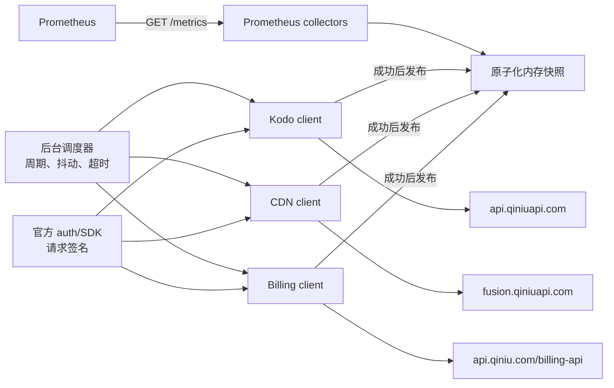

# qiniu_exporter 架构设计与指标方案

> 状态：Approved and implemented for MVP（已完成第二轮纯监控与限流复核）  
> 调研日期：2026-08-03  
> 范围：七牛对象存储 Kodo、CDN、账户财务；只读采集，不执行任何资源变更或财务操作。

## 1. 结论

建议用 Go 实现一个“后台轮询 + 内存快照”的 Prometheus exporter：

- 每个 exporter 实例只采集一个七牛账号；多账号通过部署多个实例实现，账号名由 Prometheus target label 注入。
- 使用官方 `github.com/qiniu/go-sdk/v7/auth` 完成签名；Kodo、CDN 与财务统计接口使用 `net/http` + 官方 `auth` 包构造固定的只读请求。
- Kodo、CDN、财务使用独立 poller、限流器、凭证引用和缓存快照；任一模块可独立启停。
- `/metrics` 不访问七牛 API，只读取不可变快照。上游失败时在数据集允许的陈旧期限内保留上次成功值，同时暴露采集失败和新鲜度；超过期限后停止导出该业务快照。
- 七牛返回的容量、费用、历史时间桶请求数/流量都导出为 Gauge；只有 exporter 自身累计的请求数使用 Counter。
- MVP 不采集对象 key、URL、IP、订单号、账单 ID 等高基数或敏感维度。
- CDN/Kodo 的公开统计 API 没有实时请求时延；Kodo 还没有状态码/错误率。此类 SLI 由 Blackbox Exporter、应用指标或第二阶段日志处理补齐。

### 1.1 纯监控边界

主进程只实现运营/运维统计查询。bucket、domain、region 和启用的存储类型均来自静态 allowlist；MVP 不调用资源管理域的发现接口。

代码中不实现任何创建、查询详情、删除、更新、上下线、刷新、预取、订单取消等资源管理方法，也不导出这些操作的次数、结果或状态指标。统计和财务 client 使用明确的 endpoint allowlist，不能做成可调用任意七牛 API 的通用 client。

推荐技术基线：Go 1.23+（当前 Prometheus Go client 的最低版本），七牛 Go SDK 固定到实施时已验证的版本。调研时最新版本为 [`v7.27.0`](https://pkg.go.dev/github.com/qiniu/go-sdk/v7)，不要使用无版本约束的浮动依赖。

## 2. 前提与非目标

### 2.1 当前假设

- 首版是单账号 exporter，不在一个进程中维护多套账号。
- Prometheus scrape 周期为 15～60 秒，但七牛业务 API 按各自数据更新周期轮询。
- 必须显式配置 bucket/domain allowlist；新增资源通过配置变更纳入监控。
- 财务时区固定为 `Asia/Shanghai`；Kodo/CDN 时间字段的时区必须在 PoC 中用真实账号确认，确认前由各模块的 `statistics_timezone_verified=false` 运行时门禁阻止调用和发布。
- exporter 只需要当前状态、最新完整时间桶、本月预估和最近已结算月份，不承担历史账本或报表职责。

### 2.2 首版不做

- 不调用创建、修改、删除、刷新、预取、取消订单等写接口。
- 不把 Top URL、Top IP、对象 key、客户端 IP、User-Agent 或 Referer 放入 Prometheus。
- 不持久化 24 个月财务明细，也不把 `month=YYYY-MM` 作为持续增长的 label。
- 不在 exporter 内进行有写入副作用的 Kodo PUT/DELETE 合成探测。
- 不在主 exporter 中下载或解析访问日志；如后续需要，作为独立日志流水线建设。
- 不提供订单、分账、历史账本和任意资源管理接口，即使它们是只读接口也不属于本 exporter。

## 3. 总体架构



核心行为：

1. 每个 dataset 独立调度、独立超时、独立发布快照。
2. 先完整校验响应，再替换快照。全局数据以 dataset 为原子边界；逐 bucket/domain 扇出的数据以 `dataset + resource` 为原子边界，允许健康资源继续更新，并单独记录资源新鲜度。
3. 请求失败时不把业务值写成 0，也不立即清空旧快照；更新 `collector_success=0`。超过 dataset 的 `stale_after` 后停止导出旧业务样本，自监控指标仍保留。
4. 首次采集尚未成功时，只暴露 exporter 自监控指标，业务样本缺失。
5. `/healthz` 表示进程存活；`/readyz` 只检查配置、HTTP 服务和调度器已就绪，不依赖上游首次成功。上游状态完全由采集成功与新鲜度指标表达。

Prometheus 通常建议 exporter 在 scrape 时同步采集，但也允许昂贵数据缓存。七牛接口具有低频更新、跨资源扇出和明确限流，因此这里选择后台缓存是有意的例外；数据新鲜度必须成为一等指标。参考 [Prometheus exporter 指南](https://prometheus.io/docs/instrumenting/writing_exporters/)。

## 4. API、SDK 与认证矩阵

| 模块 | Host / API | 鉴权 | SDK 策略 | 已知限制 |
|---|---|---|---|---|
| Kodo 统计 | `https://api.qiniuapi.com/v6/*` | Qiniu v2；`X-Qiniu-Date` | 自定义只读 client + `auth.AddToken(TokenQiniu, req)` | 约 5 分钟延迟；公开文档未给 QPS、最大点数和统一时区 |
| CDN 用量/运营 | `https://fusion.qiniuapi.com/v2/tune/*` | QBox | 核心 monitoring/analytics 使用固定只读 REST client + 官方 auth | 5～10 QPS；与同账号其他调用共享配额 |
| 财务 | 仅四个固定 GET：`balance-overview`、`bill/snapshot`、`respack/month-overview`、`bill/detail` | Qiniu v2 | 自定义固定 GET client + 官方 auth | 未公布 QPS；公开文档未给财务 IAM action |

### 4.1 签名实现约束

- 统一使用 [`auth.Credentials`](https://pkg.go.dev/github.com/qiniu/go-sdk/v7/auth)：`auth.New(ak, sk)` 后按接口调用 `AddToken(TokenQiniu|TokenQBox, req)`，不重复实现 HMAC 算法。
- Qiniu v2 签名覆盖 method、path/query、Host、Content-Type、相关 `X-Qiniu-*` 头及可签名 body；请求必须先完整构造再签名。
- QBox 签名规则不同，CDN `fusion.qiniuapi.com` 不能误用 Qiniu v2。
- 每次重试都要重建可重放 body；先取得 limiter token，再刷新日期头并重新签名，避免排队让签名变旧，且不能复用旧 Authorization。
- 生产 transport 只允许 `https`、精确 Host 和固定 method/path；显式 `Host` override 会在签名前拒绝。
- Kodo 的 Qiniu v2 时间头存在允许偏差，财务日界线和统计时间窗也依赖准确时钟；宿主机必须保持 NTP 同步。
- 财务文档示例没有强制 `X-Qiniu-Date`，不要在未联调前把它当作财务 API 的必需头。

### 4.2 SDK 使用边界

七牛 Go SDK 已提供：

- `auth`：Qiniu/QBox 请求签名。

SDK 未完整覆盖 Kodo `/v6/*` 统计、CDN 新 monitoring/analytics、财务 API，因此这些部分使用小型类型化 REST client；DTO 只建模实际使用字段。

## 5. 对象存储 Kodo

官方入口：[Kodo 数据统计接口](https://developer.qiniu.com/kodo/3906/statistic-interface)。

### 5.1 必要接口

| 优先级 | 数据集 | 接口 | 用途与转换 |
|---|---|---|---|
| P0 | 容量 | `/v6/space`、`space_line`、`space_intelligent_tiering`、`space_archive_ir`、`space_archive`、`space_deep_archive` | 各存储类型时点容量，Byte；当天固定 `g=5min`，取最新完整点 |
| P0 | 对象数 | 对应的 `/v6/count*` 六组独立接口 | 对象数单位为个；不是单个 `/v6/count?storage_type=...` |
| P0 | GET/出网 | `/v6/blob_io` | `hits`；`flow_out`/`cdn_flow_out` 单位 Byte；固定 `g=5min` |
| P0 | 客户业务 PUT 次数 | `/v6/rs_put?select=hits` | 只读查询客户业务产生的 PUT 请求数；exporter 本身不执行对象 PUT；固定 `g=5min` |

当前容量/对象接口的 `begin` 为闭区间、`end` 为开区间，格式 `YYYYMMDDHHmmss`；历史通常只支持 day，当天支持 5min/hour/day。`blob_io`、`rs_put` 支持 5min/hour/day/month。当前实现只使用上述 P0 端点；旧统计、跨区域任务和提前删除分析不进入 MVP。

存储类型映射固定为：

| `storage_class` | 七牛含义 | `$ftype`（用于 I/O，可选） |
|---|---|---|
| `standard` | 标准存储 | `0` |
| `ia` | 低频存储 | `1` |
| `archive` | 归档存储 | `2` |
| `deep_archive` | 深度归档存储 | `3` |
| `archive_ir` | 归档直读 | `4` |
| `intelligent_tiering` | 智能分层 | `5` |

P0 的请求与流量按 bucket 聚合，不带 `storage_class`，避免为六种 `$ftype` 再扩大 6 倍调用量；MVP 不提供按存储类型拆分 I/O 的 collector。

### 5.2 P0 指标

| 指标 | 类型 | Labels | 语义 |
|---|---|---|---|
| `qiniu_kodo_storage_bytes` | Gauge | `bucket,region,storage_class` | 最新完整点的存储容量 |
| `qiniu_kodo_objects` | Gauge | `bucket,region,storage_class` | 最新完整点的对象数量 |
| `qiniu_kodo_requests_per_second` | Gauge | `bucket,region,operation` | 最新完整桶的平均请求速率；operation 为 `get`/`put` |
| `qiniu_kodo_egress_bytes_per_second` | Gauge | `bucket,region,route` | 最新完整桶的平均出网速率；route 为 `direct`/`cdn_origin` |

`blob_io`、`rs_put` 返回的是历史区间增量，不是 exporter 生命周期内的单调累计值。因此不得命名为 `_total` 或伪装成 Counter。P0 固定请求 `g=5min` 并除以 300；同时校验时间点对齐、相邻点确为 5 分钟。缺桶或只有无法确认窗口的单点时不导出速率。以后支持其他粒度时按请求粒度的定义窗口换算，不能用缺桶后的相邻点差猜测覆盖时长。

### 5.3 Kodo 运维缺口

公开统计 API 不提供 HTTP 状态码、错误率、请求延迟、P95/P99。可选的 [空间访问日志](https://developer.qiniu.com/kodo/8614/space-access-log) 约每 10 分钟写入日志 bucket，包含 HTTP Status、RequestTime、SentBytes 等字段，可在第二阶段用独立日志处理器生成 SLI。实时可用性优先由应用指标或主动探测承担。

## 6. CDN

七牛 CDN API 体系存在“双 Host、双鉴权”，但本 exporter 不进入域名管理域，只调用 `fusion.qiniuapi.com + QBox` 的统计接口。官方总览见 [CDN API 列表](https://developer.qiniu.com/fusion/13353/fusion-api-overview)。

### 6.1 必要接口

| 优先级 | 数据集 | 接口 | 关键约束 |
|---|---|---|---|
| P0 | 实时监控带宽 | `POST /v2/tune/monitoring/bandwidth` | domains 是分号字符串，最多 50；5min/hour/day |
| P0 | 实时监控流量 | `POST /v2/tune/monitoring/flow` | 同上；监控数据保留 90 天 |
| P0 | 请求量 | `POST /v2/tune/loganalyze/reqcount` | domains 是数组；5min/1hour/1day |
| P0 | 状态码 | `POST /v2/tune/loganalyze/statuscode` | 返回 `codes[statusCode]` 时间序列；保留响应键并在 PoC 确认其粒度 |
| P0 | 命中率 | `POST /v2/tune/loganalyze/hitmiss` | 返回 hit/miss 次数和命中/未命中流量，由 exporter 算比例 |

CDN 用量接口一次最多 50 个域名，响应保留 domain 维度，可以批量。运营统计虽然允许最多 100 个域名，但响应结构没有 domain 维度；要输出每域名指标，MVP 每次只查询一个域名。这个聚合行为列为 PoC 必验项。

域名完全来自显式 allowlist。批量 monitoring 遇到 `400032` 时通过二分找出坏域名并负缓存，同时将其标记为配置错误，避免一个失效域名冻结整批数据。每轮二分最多执行 16 个 batch attempt（每个 attempt 最多调用 bandwidth、flow 各一次）；预算耗尽的域名本轮失败但不进入负缓存，下轮再判断。

### 6.2 P0 指标

| 指标 | 类型 | Labels | 语义 |
|---|---|---|---|
| `qiniu_cdn_monitoring_bandwidth_bits_per_second` | Gauge | `domain,region` | 最新完整监控桶带宽 |
| `qiniu_cdn_monitoring_traffic_bytes_per_second` | Gauge | `domain,region` | 最新完整监控桶流量除以桶秒数 |
| `qiniu_cdn_requests_per_second` | Gauge | `domain,region` | reqcount 最新完整桶平均 RPS |
| `qiniu_cdn_http_responses_per_second` | Gauge | `domain,region,code` | 状态码平均 RPS；保留 API 返回的受控 code 原值，不假定一定是类别或精确码 |
| `qiniu_cdn_cache_requests_per_second` | Gauge | `domain,result` | hit/miss 请求数除以桶秒数；result 为 `hit`/`miss` |
| `qiniu_cdn_cache_traffic_bytes_per_second` | Gauge | `domain,result` | hit/miss 流量除以桶秒数 |
| `qiniu_cdn_cache_request_hit_ratio` | Gauge | `domain` | `hit / (hit + miss)`，范围 0～1 |
| `qiniu_cdn_cache_traffic_hit_ratio` | Gauge | `domain` | `trafficHit / (trafficHit + trafficMiss)`，范围 0～1 |

监控 bandwidth/flow 文档没有再次明确响应单位，虽然语义预计沿用 bps/Byte，但正式启用上述带单位指标前必须用控制台和真实响应完成单位校验。配置 `cdn.monitoring_units_verified` 默认 `false`；未确认时不调用这两个接口，记录 `reason="units_unverified"` 的调度跳过且不创建永久失败状态，不发布单位相关业务样本。确认带宽为 bit/s、流量为五分钟桶 Byte 后才可设为 `true`。所有 CDN 采集还受 `statistics_timezone_verified` 门禁约束。

### 6.3 CDN 运维缺口

公开运营统计 API 没有实时响应时延。CDN 访问日志包含 `ResponseTime`（毫秒），但约 6 小时延迟，不适合实时故障告警。建议：

- 实时域名可用性、DNS/TLS/HTTP 时延：Blackbox Exporter。
- 七牛侧历史 P50/P95/P99：第二阶段异步解析已完成小时的 CDN 日志。
- Top URL/IP：只进入日志/报表系统，不进入 Prometheus。

## 7. 财务

官方入口：[财务对外 API 文档](https://developer.qiniu.com/af/10420/financial-external-api-documentation)。财务数据是低频账务快照，不应按 Prometheus scrape 周期请求。

### 7.1 必要接口

| 优先级 | 数据集 | 接口 | 用途与时间语义 |
|---|---|---|---|
| P0 | 余额 | `GET /billing-api/v1/account/balance-overview` | 可用额度、欠费、现金/赠送金/信用额度；预估字段只作交叉校验 |
| P0 | 每日预估 | `GET /billing-api/v2/bill/snapshot?date=...` | 当天 08:00 后查询；当月 1 日至查询日 00:00，不含查询日 |
| P0 | 资源包 | `GET /billing-api/v1/respack/month-overview` | 本月总可用、已用、剩余；分页最大 200 |
| P0 | 最终月账单 | `GET /billing-api/v2/bill/detail?start=...&end=...` | 使用顶层 `total_money`；每月 5 日后读取上月 |

金额字段为保留 8 位小数的定点整数，导出前除以 `100000000`。币种可能为 CNY 或 USD，所以指标名不硬编码 `_yuan`，通过受控 `currency` label 表示币种，HELP 文本明确值为该币种的主单位。

`bill/overview` 返回账单/订单条目，不提供可靠的顶层月总额；最近已结算总额必须使用 `bill/detail` 的 `total_money`。余额接口字段表写 `available_balance`，响应示例却写 `balance`，DTO 需要兼容两者并在同时出现且不一致时报错。

### 7.2 P0 指标

| 指标 | 类型 | Labels | 语义 |
|---|---|---|---|
| `qiniu_billing_available_balance` | Gauge | `currency` | 当前可用额度，币种主单位 |
| `qiniu_billing_unpaid_amount` | Gauge | `currency` | 当前未支付金额 |
| `qiniu_billing_estimated_cost` | Gauge | `currency` | `bill/snapshot.total_money` 对应账期的累计预估费用；不强称 MTD |
| `qiniu_billing_estimate_period_start_timestamp_seconds` | Gauge | 无 | 每日预估覆盖账期的起始时间 |
| `qiniu_billing_estimate_period_end_timestamp_seconds` | Gauge | 无 | 每日预估覆盖账期的结束时间（开区间） |
| `qiniu_billing_resource_pack_records` | Gauge | 无 | 完整分页结果中的资源包月概览记录数；0 可用于 absence 告警 |
| `qiniu_billing_resource_pack_total` | Gauge | `item,zone,available_time,unit` | 本月可用总量，禁止跨 unit 聚合 |
| `qiniu_billing_resource_pack_used` | Gauge | `item,zone,available_time,unit` | 本月已用量 |
| `qiniu_billing_resource_pack_remaining` | Gauge | `item,zone,available_time,unit` | 本月剩余量 |
| `qiniu_billing_resource_pack_remaining_ratio` | Gauge | `item,zone,available_time,unit` | `month_remain / total_surplus`，范围 0～1；无记录时不导出 |
| `qiniu_billing_last_finalized_cost` | Gauge | `currency` | 最近已完整结算月份总费用 |
| `qiniu_billing_last_finalized_period_start_timestamp_seconds` | Gauge | 无 | 最近已结算月份起始时间 |

每月 1 日的 snapshot 代表上月整月，而非当月 MTD；因此预估指标使用中性名称并同时暴露 period start/end。不要将 `bill_id`、`order_hash`、`po_id`、email、月份字符串或任意分账标签作为 label。

资源包原始用量存在 GB、千次、分钟等混合单位，所以保留受控 `unit` label，并在规则和看板中禁止跨单位求和。`item/zone/available_time/unit` 必须与配置中的四元组静态 allowlist 精确匹配；allowlist 为空时不调用资源包接口，也不导出对应指标。资源包分页必须全有或全无：任一页失败或出现未配置标签时不发布部分结果；完整成功但列表为空时原子清空旧资源包快照并导出 `records=0`。MVP 最多读取 50 页（每页 200 条），达到上限仍未结束则整轮失败，防止异常分页造成无界调用。币种仅接受官方文档列出的 `CNY`、`USD`。

## 8. Exporter 自监控指标

| 指标 | 类型 | Labels | 语义 |
|---|---|---|---|
| `qiniu_exporter_build_info` | Gauge=1 | `version,revision,goversion` | 构建信息 |
| `qiniu_exporter_collector_success` | Gauge | `module,collector` | 单任务最近一次或所有配置资源各自最近一次轮询都成功时为 1 |
| `qiniu_exporter_collector_last_success_timestamp_seconds` | Gauge | `module,collector` | 单任务最近成功时间；资源型任务取各资源最近成功时间的最旧值 |
| `qiniu_exporter_collector_stale_after_seconds` | Gauge | `module,collector` | 该已启用 collector 配置的数据最大保鲜时长；用于告警阈值 |
| `qiniu_exporter_data_timestamp_seconds` | Gauge | `module,collector` | 当前快照对应的上游数据有效时间；上游未提供数据时间时不导出 |
| `qiniu_exporter_collection_duration_seconds` | Gauge | `module,collector` | 最近一次轮询耗时 |
| `qiniu_exporter_api_requests_total` | Counter | `service,endpoint,result` | exporter 生命周期内上游调用次数；endpoint/result 为受控枚举 |
| `qiniu_exporter_api_request_duration_seconds` | Histogram | `service,endpoint` | 上游 API 调用时延 |
| `qiniu_exporter_api_rate_limit_events_total` | Counter | `service,host` | 429/403024 触发次数 |
| `qiniu_exporter_api_limiter_wait_duration_seconds` | Histogram | `service,host` | 获取本地限流 token 的等待时长 |
| `qiniu_exporter_scheduler_skipped_total` | Counter | `module,collector,reason` | 因安全门禁或任务超周期而跳过/延后的次数 |
| `qiniu_exporter_resource_collector_success` | Gauge | `module,collector,resource` | 逐 bucket/domain 最近一次轮询是否成功 |
| `qiniu_exporter_resource_last_success_timestamp_seconds` | Gauge | `module,collector,resource` | 逐资源最近成功时间 |
| `qiniu_exporter_resource_data_timestamp_seconds` | Gauge | `module,collector,resource` | 逐资源上游数据有效时间；未知时不导出 |

`result` 只允许 `success`、`api_error`、`rate_limited`、`http_4xx`、`http_5xx`、`transport_error`、`decode_error` 等有限枚举，不使用原始错误文本。先校验 HTTP 状态，再校验 JSON envelope；例如财务 HTTP 200 但 `code != 0` 必须归类为 `api_error` 并令本轮失败。上游数据时间已知时，用 `time() - qiniu_exporter_data_timestamp_seconds > qiniu_exporter_collector_stale_after_seconds` 判断业务数据是否过期；未知时对 `collector_last_success_timestamp_seconds` 使用同一配置阈值，无需导出重复的 age 指标。

dataset 级 `collector_success` 只有在所有配置资源的最近一次轮询均成功时才为 1；资源型 collector 的 `collector_last_success_timestamp_seconds` 取各配置资源最近成功时间的最旧值，不能因某一个健康资源持续成功而滚动前移。逐资源失败由 resource 指标定位。dataset 级 `data_timestamp` 取当前资源快照中最旧的已知上游时间，逐资源告警则使用 resource data timestamp。只有实际启用的 collector 才导出 `collector_stale_after_seconds`，因此禁用功能不会被通用新鲜度规则误报。

## 9. 标签与基数规则

允许的业务 label：

- Kodo：`bucket`、`region`、`storage_class`、有限枚举的 operation/route。
- CDN：`domain`、`region`、API 返回并经过格式校验的状态码键。
- 财务：`currency`，以及经过 allowlist 的 `item`、`zone`、`available_time`、`unit`。

资源包 allowlist 最多 200 个四元组，对应最多约 800 条明细业务 series；需要更多时应拆分 exporter/监控范围并先评估 Prometheus 基数，而不是放宽无界上限。CDN 状态码响应不得在同一类别同时出现聚合键和精确键（例如 `5xx` 与 `500`），避免规则重复计数。

禁止的 label：AK/SK、UID/email、account_id、object key、完整 URL、客户端 IP、User-Agent、Referer、CNAME、task ID、order/bill/po ID、时间戳字符串、任意未受控 bucket tag。

首版不在每个指标上添加 `account` label。单账号 exporter 的账号别名应由 Prometheus scrape 配置作为 target label 注入，例如 `qiniu_account="production"`。这符合“所有指标共有的维度属于目标标签”的 Prometheus 约定，也避免 exporter 内部重复维护。

## 10. 调度、限流与调用预算

### 10.1 两级限流

所有请求都经过分层 limiter。第一层按 `account + 实际 hostname` 限制账号对该 host 的总速率，第二层按 endpoint class 进一步收紧未知配额接口；另有只作用于 attempt 0 的正常采集预算。主账号和子账号共享 CDN 配额，因此不能按 credential 各建一套令牌桶。

| Quota group | 硬上限 | 首请求预算 | 重试预算 | Burst | 最大并发 | 依据 |
|---|---:|---:|---:|---:|---:|---|
| `qiniu-api-shared` (`api.qiniu.com`) | 10 QPS | 8 QPS | 2 QPS | 1 | 4 | 账号对该 Host 的官方上限；当前仅财务请求经过 |
| `cdn-fusion` (`fusion.qiniuapi.com`) | 5 QPS | 4 QPS | 1 QPS | 1 | 4 | 官方为 5～10 QPS，取下限 |
| `kodo-stats` (`api.qiniuapi.com`) | 1 QPS | 0.8 QPS | 0.2 QPS | 1 | 1 | 本地保护值，官方未公布 |
| `billing` (`api.qiniu.com`) | 1 QPS | 0.8 QPS | 0.2 QPS | 1 | 1 | endpoint 子限流；本地保护值，官方未公布 |

正常采集请求通过 attempt-0 limiter，最多使用有效硬上限的 80%；重试通过独立 limiter，最多使用有效硬上限的 20%。有效硬上限是请求路径上所有 Host/endpoint 上限的最小值；例如 Billing 取 `min(qiniu_api_host_max_qps, billing_max_qps)`。两类请求仍必须获取每层硬 limiter 的 token，因此组合流量永远不能突破任一硬上限。分页和错误隔离属于新的正常请求，也要获取 attempt-0 与硬 limiter，不能走旁路；CDN 隔离另有单轮 16 batch attempt 上限。调低 `first_request_utilization` 不会扩大重试预算。上述 limiter 是进程内的；若要给同账号的其他程序留出容量，必须继续下调本 exporter 的硬上限，多实例则需使用共享的外部分布式 limiter。配置只能把代码内的保护上限调低，不支持本地 override。

### 10.2 摊平调度、批处理与缓存

- 每个 `dataset + resource` 使用稳定 phase（资源名 hash 对周期取模）分布到整个周期，不在每个 5 分钟边界集中扇出；仅增加小幅随机抖动。
- 每个任务由单一串行循环执行，上一轮未结束时不会叠加同任务请求，也不存在无界待处理队列。稳定 phase、独立 context deadline 和分层 limiter 共同控制竞争；MVP 不实现会引入额外状态的中央优先级队列。
- CDN monitoring bandwidth/flow 每批最多 50 个域名。Analytics 响应没有 domain 维度时只能单域名查询，不能把聚合值错误拆回各域名。
- Kodo `/v6/*` 不按 bucket 返回分组，逐 bucket 指标必然扇出；只查询显式 allowlist 和实际启用的 storage class。
- 查询窗口只覆盖选择最新完整点所需的最小范围（CDN 只有日期粒度的查询参数时覆盖当天）；冷启动不扫描历史。相同 `dataset + resource` 只有一个调度任务，上一轮未完成时不再发起同窗口请求。
- `/metrics` 永不访问上游。Kodo/CDN 实时结果缓存至下一轮，余额缓存 1 小时，daily/finalized 财务结果缓存到下一安全账期。
- `400032` 无效域名负缓存到配置变更或进程重启，避免每轮重复打坏域名；同时持续暴露该资源的采集失败状态。

### 10.3 推荐周期与冷启动

| Dataset | 周期 | 冷启动行为 |
|---|---|---|
| Kodo 容量/对象数 | 15 分钟 | 在第一个完整周期内按 resource phase 铺开 |
| Kodo GET/PUT/出网 | 5 分钟 | 在第一个完整周期内铺开，只读取最新安全桶 |
| CDN monitoring/analytics | 5 分钟 | 在第一个完整周期内按 domain 铺开 |
| 财务余额 | 60 分钟 | 启动后立即采集 |
| 财务预估/资源包 | 每日 08:15 后 | 08:15 后启动立即补采；此前使用最近安全日期，每月 1 日早晨等待 08:15 |
| 最终月账单 | 每月 5 日起每日一次，成功即停 | 启动立即寻找最近完整月；1～4 日通常取上上月，5 日后取上月 |

固定间隔任务在首次稳定 phase 后增加约 ±10% 随机抖动。官方要求每日预估在 08:00 后查询；exporter 留出安全余量，固定从 08:15 开始，资源包从 08:16 开始。启动判定由调度器在计算首次 delay 的同一时刻执行，避免跨 08:15 的竞态。资源包分页任一页失败时整轮失败；只有全部页面成功后才能原子发布。

### 10.4 启动调用预算准入

启动时必须根据配置计算需求并做 admission，不能只记录平均 QPS 后继续超额运行：

- Kodo 首请求速率约为 `B × (4/300 + 2×S/900)` QPS；`B` 为 bucket 数，`S` 为启用存储类型数。`S=6`、本地硬上限 1 QPS、80% 首请求预算时，逐 bucket 模式约最多容纳 29 个 bucket。时区门禁未通过时不发请求，也不计 admission。
- CDN fusion 首请求速率约为 `[2×ceil(D/50) + 3×D] / 300` QPS；`D` 为 domain 数。异常隔离不计入稳定态 admission，但受同一 attempt-0 limiter 和单轮 16 batch attempt 上限约束。`monitoring_units_verified=false` 时不调用两个 monitoring 接口，准入计算临时去掉前一项；时区门禁未通过时不发任何 CDN 请求。
- 财务稳定态调用量很低；余额、每日接口和完整分页仍受 1 QPS、burst 1、单并发约束，资源包 allowlist 为空时不发起分页。

预计需求超过 80% 首请求预算时，该 collector 拒绝启动并输出明确配置错误。处理顺序是：收紧 allowlist、只保留 P0、延长容量周期、改用账号/region 聚合语义，最后再向七牛申请配额。不能靠同账号多实例扩容；若必须多实例，需共享外部分布式 limiter，所有实例总预算仍不得超过账号配额。

### 10.5 退避与自适应降速

- 只对 transport error、429、`403024` 和 5xx 重试，最多 2 次；普通 4xx 不重试。优先遵循 `Retry-After`，否则两次重试分别使用不超过 1 秒、2 秒的 full-jitter 退避。
- 任一 429/`403024` 触发该 `account + host` 至少 5 秒 cooldown，并将有效速率减半；连续 5 分钟没有再限流后再逐步恢复，不能每个请求各自盲目重试。
- HTTP 200 但业务 `code != 0` 默认不重试；只有明确列入瞬时错误 allowlist 的业务码可重试。
- `400032` 不做普通重试：批量请求直接做有上限的二分隔离并负缓存坏域名，防止最坏情况无限放大请求。
- 统计 POST 是只读查询，可在完整重建 body、日期头和签名后重试。单轮总超时必须小于 dataset 周期。
- 日志可记录 `X-Reqid`、service、endpoint 和错误类别，但不得记录 Authorization、AK/SK 或完整响应体中的账号信息。

## 11. 数据转换与异常语义

- 使用响应时间数组选择“最新完整且超过安全滞后”的点，不直接取数组最后一个元素。
- 速率换算按请求的名义 granularity；必须校验时间对齐和连续性，缺桶不跨洞摊薄。
- 严格校验时间数组和数据数组长度、单调时间、非负容量/数量、有限浮点值及受控枚举。
- 上游明确返回 0 才导出 0；缺数据、解码失败、数组错位时不伪造 0。
- 同一原子快照涉及多个 endpoint 时，所选 `BucketEnd/DataAt` 必须完全一致；不一致时保留旧快照并令本轮失败，不能用最旧时间掩盖混合时间桶。
- 比例分母为 0 时该样本不导出；资源包明确“总可用=0 且剩余=0”可按耗尽语义导出 0，但需记录测试用例。
- 所有上游历史时间桶业务值均为 Gauge。Prometheus scrape 时间表示观察时间，`qiniu_exporter_data_timestamp_seconds` 才表示业务数据时间。
- `last_success_timestamp` 是 exporter 获取时间，不能冒充上游 `data_timestamp`。业务快照以 `CollectedAt` 与已知 `DataAt` 中较早者计算 `stale_after`；即使 API 请求持续成功，冻结的旧上游桶也会停止导出。告警规则必须同时检查 collector success/last success。
- 启用 Kodo/CDN 时，`stale_after.realtime` 至少为 `source_lag + 5m`，否则启动失败，避免刚采到的完整桶立即被判为过期。
- 财务定点整数先用整数/decimal 安全转换，再转 `float64` 暴露；禁止先转浮点再除导致不必要的精度损失。

## 12. 权限与密钥

### 12.1 最小权限

Kodo 官方 IAM action：

- `kodo/statistics`：读取计量统计。

`kodo/statistics` 是资源级 action；按 bucket 授权时使用对应 bucket QRN。省略 bucket 做账号聚合统计通常需要 `*`/全 bucket 资源授权，必须在测试账号验证。

CDN P0 建议 action：

- `cdn/GetBandwidthAndFlux`
- `cdn/GetReqCount`
- `cdn/GetStateCode`
- `cdn/GetHitRate`

域名资源权限按实际 allowlist 收紧；统计类 action 中部分是服务级。禁止授予 `CreateDomain`、`DeleteDomain`、`OnlineDomain`、`OfflineDomain`、`Update*`、`Refresh`、`Prefetch`。参考 [CDN IAM Actions](https://developer.qiniu.com/af/12493/cdn-actions)。

财务公开文档没有提供 Billing/Financial IAM action。实施前必须验证 IAM Key 能否访问；如果只能使用主账号 AK/SK：

- 财务 client 只允许设计中列出的固定 GET 路径，代码中不实现订单取消等写 API。
- 单实例内 Kodo、CDN、Billing 统一引用 `main` credential；启用 Billing 时该凭据必须属于具有财务权限的管理员账号。
- 普通子用户凭据部署时关闭 Billing。高安全环境将 Billing 模块部署为单独 exporter 实例，并在该实例中继续使用标准 `QINIU_ACCESS_KEY`、`QINIU_SECRET_KEY` 注入管理员凭据。
- 通过网络策略限制实例只能访问七牛 API 和被 Prometheus 抓取。

### 12.2 Secret 注入

- 配置文件只保存环境变量名或 Secret 文件路径，不保存 AK/SK 明文。
- 支持 `access_key_env`、`secret_key_env` 或 `*_file`；禁止通过 CLI flag 传 secret，避免进入进程列表。
- 配置 dump、错误日志、pprof 和指标不得出现凭证。
- SDK debug 日志默认关闭。

## 13. 建议配置形态

以下仅定义配置意图，不是最终字段承诺：

```yaml
server:
  listen: ":9106"

credentials:
  main:
    access_key_env: QINIU_ACCESS_KEY
    secret_key_env: QINIU_SECRET_KEY

kodo:
  enabled: true
  credential: main
  statistics_timezone_verified: false
  buckets:
    - name: example-bucket
      region: z0
  storage_classes: [standard, ia, archive_ir, archive, deep_archive, intelligent_tiering]

cdn:
  enabled: true
  credential: main
  statistics_timezone_verified: false
  monitoring_units_verified: false
  domains: [cdn.example.com]

billing:
  enabled: true
  credential: main
  timezone: Asia/Shanghai
  resource_pack_allowlist:
    - item: CDN加速通用计费项
      zone: 中国大陆
      available_time: 全时段
      unit: GB

collection:
  source_lag: 10m
  stale_after:
    realtime: 30m
    billing_balance: 3h
    billing_daily: 36h
    billing_finalized: 40d
  kodo_max_qps: 1
  cdn_fusion_max_qps: 5
  qiniu_api_host_max_qps: 10
  billing_max_qps: 1
  limiter_burst: 1
  first_request_utilization: 0.8
  kodo_max_concurrency: 1
  cdn_max_concurrency: 4
  billing_max_concurrency: 1
```

## 14. 代码结构建议

```text
cmd/qiniu-exporter/        进程入口、flag、生命周期
internal/config/           配置解析、校验、secret 引用
internal/authhttp/         可重签名 HTTP client、固定 endpoint policy
internal/limiter/          Host/endpoint 两级限流与自适应降速
internal/qiniu/kodo/       /v6 统计 DTO/client
internal/qiniu/cdn/        monitoring、analytics DTO/client
internal/qiniu/billing/    固定只读 GET client、金额转换
internal/poller/           调度、抖动、限流、重试
internal/snapshot/         不可变 dataset 快照与原子发布
internal/collector/        Prometheus 描述符和 Collect
internal/telemetry/        exporter 自监控指标
internal/app/              三模块任务注册与快照发布
```

避免建立通用“万能七牛 API 框架”。三个模块只共享确实相同的 HTTP、签名、重试和快照原语；请求/响应 DTO 保持模块内局部、明确。

## 15. 实施分期与验收

### 阶段 0：真实账号 PoC

1. 验证三类签名、时间头和重试重签名。
2. 记录脱敏 fixtures，确认 CDN monitoring 单位、CDN analytics 多域名是否聚合、Kodo/CDN 时间字段时区。
3. 验证 Kodo/CDN 统计类最小 IAM action、财务 IAM Key 可用性。
4. 获取实际 bucket/domain 数，代入调用预算后确定 allowlist、并发和周期。
5. 对照控制台核对一组容量、对象数、带宽/流量、命中率、余额和最终账单。

### 阶段 1：MVP

1. 完成配置、签名 HTTP、限流/重试、快照和自监控。
2. 实现三模块 P0 client 与 collector。
3. 提供 `/metrics`、`/healthz`、`/readyz`、Docker 镜像和最小部署示例。
4. 提供 Prometheus recording/alert rules：采集失败、数据过期、余额不足、资源包不足、CDN 5xx 比例、命中率下降、Kodo 容量增长。

### 必须通过的验收

- `go test ./...` 和 `go test -race ./...` 通过。
- httptest 覆盖 Qiniu/QBox 签名顺序、重试重新签名、body 重放、限流和超时。
- fixtures 覆盖空数组、数组错位、重复/乱序时间点、429/403024、5xx、财务字段别名和 8 位定点数。
- `/metrics` 路径零上游网络调用；上游中断后仍能抓取自监控和旧快照，且 freshness 告警能够触发。
- 同一 fixture 重复采集不会产生新的 label 集；没有 `_total` 形式的上游历史桶业务指标。
- 日志、指标和错误信息扫描不到 AK/SK、Authorization、email、account_id、order/bill ID。

## 16. 与原交接稿相比的关键修正

1. 官方 Go SDK 虽封装了基础 CDN 计量和日志能力，但它们不在当前核心范围；MVP 只实现 monitoring/analytics 的固定只读 REST client。
2. Kodo 各存储类型容量/对象数使用不同 `/v6/space*`、`/v6/count*` 端点，不是给 `/v6/count` 增加一个统一 `storage_type` 参数。
3. 月总费用应使用 `bill/detail.total_money`；`bill/overview` 是条目概览，不能当作月总额。
4. 财务还有 `bill/snapshot` 每日预估接口；它是运营成本监控的核心数据源。
5. Kodo 和财务未公布 QPS，不得套用 CDN 的 5～10 QPS；配置中的 1 QPS只是 exporter 自身的安全默认值。
6. 上游时间桶请求数、流量、费用快照会回溯、修订或重置，必须是 Gauge，不能使用 `_total` Counter。
7. CDN/Kodo 公开统计不具备完整实时延迟 SLI，不能虚构对应指标。

## 17. 官方资料

- [七牛 Go SDK](https://pkg.go.dev/github.com/qiniu/go-sdk/v7)
- [七牛 Go auth 包](https://pkg.go.dev/github.com/qiniu/go-sdk/v7/auth)
- [Kodo 数据统计接口](https://developer.qiniu.com/kodo/3906/statistic-interface)
- [Kodo blob_io](https://developer.qiniu.com/kodo/3820/blob-io)
- [Kodo rs_put](https://developer.qiniu.com/kodo/3912/rs-put)
- [Kodo IAM Actions](https://developer.qiniu.com/af/12495/kodo-iam-actions)
- [CDN API 总览](https://developer.qiniu.com/fusion/13353/fusion-api-overview)
- [CDN 用量统计](https://developer.qiniu.com/fusion/13365/fusion-api-usage-stats)
- [CDN 运营统计](https://developer.qiniu.com/fusion/13366/fusion-api-analytics)
- [CDN 鉴权](https://developer.qiniu.com/fusion/13360/fusion-api-auth-guide)
- [CDN IAM Actions](https://developer.qiniu.com/af/12493/cdn-actions)
- [财务对外 API](https://developer.qiniu.com/af/10420/financial-external-api-documentation)
- [Prometheus exporter 指南](https://prometheus.io/docs/instrumenting/writing_exporters/)
- [Prometheus 指标命名](https://prometheus.io/docs/practices/naming/)
